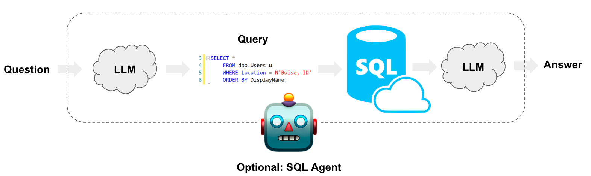

## Project Overview: Text To SQL LLM App
The code showcases the creation of a text to SQL LLM application using Google Gemini Pro, which is capable of converting natural language text into SQL queries and retrieving data from an SQL database.

### How it works

#### Technical Details
- Created a SQLite database for student records using Python and SQL
- Utilized Google Generative AI to generate SQL queries from natural language prompts
- Implemented a user interface for the LLM application using Streamlit
- Integrated the LLM application with the SQLite database to retrieve data
- Used Python to load environment variables and configure the Google Gemini Pro API key

###### Author
- Jazay Ahmad